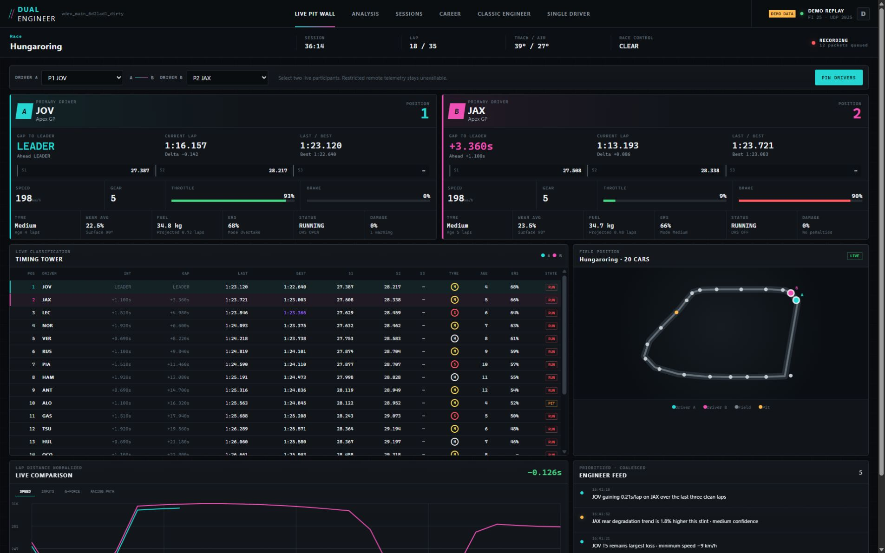
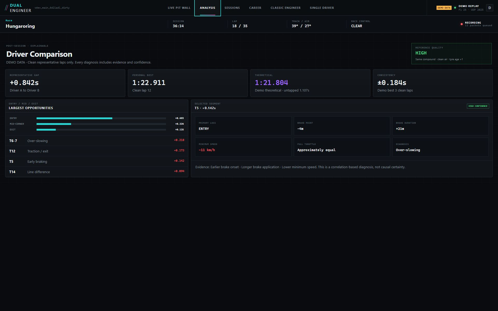

# F1 Dual Engineer

**A local-first dual-driver pit wall, lap-comparison coach, and career companion for EA Sports F1 25.**

[Download F1 Dual Engineer v0.1.0 for Windows](https://github.com/jlsp124/f1-dual-engineer/releases/tag/v0.1.0) · [Setup guide](docs/RUNNING.md) · [Data formats](docs/DATA_FORMATS.md)



F1 Dual Engineer lets a third person monitor two selected players at once while retaining the full grid for context. Driver A and Driver B stay visible together, with live timing, a track map, distance-normalized traces, concise engineer messages, automatic recording, post-session analysis, and an optional local career database. Names are selected from the live participant list; nothing is hard-coded to a particular household or team.

The application processes telemetry on your machine. It does not upload sessions or use a cloud service.

## What v0.1.0 includes

- Permanent Driver A / Driver B cards with laps, sectors, gaps, tyres, fuel, ERS, inputs, damage, penalties, and clean `Unavailable` states when F1 privacy rules withhold data.
- Full-field timing tower and live world-coordinate track map with the selected drivers emphasized.
- Lap-distance-normalized speed, input, G-force, and racing-path comparison.
- Deterministic segment analysis: braking zones, entry/mid/exit loss, braking and throttle differences, minimum speed, line variation, evidence, and confidence.
- Clean-lap PB, best-three consistency, sector and mini-sector theoretical laps, with invalid/pit/formation/SC/discontinuous laps rejected.
- Automatic bounded background recording: replay-compatible raw packets plus interoperable CSV and JSON exports.
- Local session browser with report, folder, and ZIP export actions.
- Optional SQLite career companion with manual mid-season standings import, observed final-classification ingestion, driver/constructor standings, race/qualifying/sprint head-to-head, and live points projection.
- Preserved upstream single-driver dashboard, HUD overlays, save viewer, stream overlay, forwarding, and MCP surfaces.
- Clearly labelled `DEMO DATA` mode for setup and UI evaluation without a running game.



## Supported game

The independent v0.1.0 release targets **F1 25 using UDP Format 2025**. Older game parsers and upstream tools remain in the codebase, but dual-driver recording and analysis are only release-tested against the current F1 25 packet model and deterministic fixtures. It is not affiliated with Formula 1, the FIA, Electronic Arts, Codemasters, or any team.

## Windows installation

1. Download `f1_dual_engineer_0.1.0.exe` from the [v0.1.0 release](https://github.com/jlsp124/f1-dual-engineer/releases/tag/v0.1.0).
2. Keep it in a writable folder and launch it. The launcher starts the telemetry backend and opens `http://127.0.0.1:4768/`.
3. Windows may show a SmartScreen warning because the community binary is not code-signed. Verify the published SHA-256 checksum, then use Windows' normal **More info → Run anyway** flow only if you trust this repository. No security protection is disabled.
4. In the launcher settings, open **Engineer** to configure preferred drivers, export directory, retention, structured sample rate, and alert categories.

The executable is standalone; Python, Node, and Poetry are not required for normal use.

## F1 25 UDP setup

On the console or gaming PC, open **Settings → Telemetry Settings** and use:

- UDP Telemetry: `On`
- UDP IP Address: the engineer laptop's LAN IPv4 address
- UDP Port: `20777` (or the value configured in F1 Dual Engineer)
- UDP Send Rate: `60 Hz`
- UDP Format: `2025`
- Show UDP Data / participant names: enabled where offered
- Your Telemetry: `Public` for each remote player when detailed car telemetry is required

Allow inbound UDP on the configured port through Windows Firewall on private networks. The game can run on a console or another PC; the UDP receiver listens for those packets. The web dashboard itself binds to `127.0.0.1` by default. Set the dashboard bind address to `0.0.0.0` only when another trusted LAN device must view it, and never port-forward it to the public internet.

For two-player/split-screen sessions, both locally controlled indices are recognized. For ordinary multiplayer, F1 25 can restrict another player's high-detail car packets. Timing and public world position remain useful, while restricted inputs, tyres, fuel, ERS, and damage are shown as unavailable instead of guessed.

## Using the pit wall

1. Start the launcher and its Telemetry Backend subsystem before entering the session.
2. Open **Dual Pit Wall**, select two different live participants, and choose **Pin Drivers**. The selection is remembered by normalized name when participants reorder.
3. Keep the main screen visible for the driver cards, tower, map, comparison trace, and engineer feed.
4. Recording begins automatically after a live session UID is established. The session finalizes on final classification, session change, or orderly shutdown.
5. Use **Sessions** to view a finalized report, open its folder, or download a ZIP.
6. Use **Career** to create a local season and import current driver/constructor points and round number. Future observed results update the active career.

Append `?demo=1` to the dashboard URL or press **D** to enable representative demo data. Every demo surface is visibly labelled and no export is produced.

## Session exports and privacy

The default `exports/` directory contains one folder per session and `f1_dual_engineer.sqlite`. A finalized folder contains:

```text
Hungaroring_2026-08-12_Race/
  raw_telemetry.f1pcap
  telemetry_samples.csv
  laps.csv
  classification.csv
  driver_a_vs_driver_b.csv
  corner_analysis.csv
  session_summary.json
```

Raw `.f1pcap` preserves received F1 packets in the upstream replay-compatible 1.1 format. The structured CSV is sampled at 20 Hz by default to keep analysis responsive and distribution simple; Parquet was intentionally avoided in v0.1.0 to avoid a large native dependency. Recording is bounded by configurable per-session, total-storage, and minimum-free-space limits. Exports, databases, local config, logs, and capture files are ignored by Git. See [data formats](docs/DATA_FORMATS.md) and [privacy/security](docs/PRIVACY.md).

## Development

Requirements: Windows/macOS, Python 3.12 or 3.13, Poetry 2.2.1, Node 22, pnpm 10, and Git submodules.

```powershell
git clone --recurse-submodules https://github.com/jlsp124/f1-dual-engineer.git
cd f1-dual-engineer
py -3.13 -m pip install poetry==2.2.1
py -3.13 -m poetry install --no-interaction --no-root
py -3.13 -m poetry run python -m apps.launcher
```

To run only the backend during development:

```powershell
py -3.13 -m poetry run python -m apps.backend
```

The dashboard is then at `http://127.0.0.1:4768/`. Run the deterministic suite with:

```powershell
py -3.13 -m poetry run pytest tests/
node --check apps/frontend/js/dualEngineer.js
```

Build the standalone app with:

```powershell
py -3.13 -m poetry run python scripts/build.py
```

The output is `dist/f1_dual_engineer_0.1.0.exe`. Detailed instructions are in [RUNNING.md](docs/RUNNING.md), [BUILDING.md](docs/BUILDING.md), and [TESTING.md](docs/TESTING.md).

## Known limitations

- Detailed remote-player telemetry depends on F1 25 privacy settings and packet availability; unavailable values are never inferred as measurements.
- Wheel slip ratio/angle and individual wheel speeds are not exposed for arbitrary remote cars by the F1 25 player-specific MotionEx packet, so v0.1.0 does not claim them.
- Raw capture is complete and replayable; structured selected-driver CSV is deliberately downsampled (1–30 Hz, 20 Hz default).
- Analysis uses stable telemetry-derived segments when official corner geometry is unavailable. It labels distance/segment windows rather than inventing corner numbers.
- Theoretical/reference-quality analysis only appears when comparable clean selected-driver laps exist.
- Career results come from observed UDP classifications and manual local imports. The application does not read or modify proprietary EA save files.
- Manual correction is currently performed by re-importing the current standings; detailed historical event editing is planned after the release-critical flow is proven in real leagues.
- The primary Dual Engineer dashboard is fully self-hosted. Inherited classic pages still fetch pinned UI libraries/fonts from third-party CDNs when opened; no telemetry is put in those request URLs.
- The Windows executable is unsigned.

## Contributing and license

Issues and focused pull requests are welcome. Preserve privacy fallbacks, explainable analysis, bounded hot-path work, tests, and upstream license headers. Please run the full tests before opening a pull request.

F1 Dual Engineer is an independent fork derived from [Pits n' Giggles](https://github.com/ashwin-nat/pits-n-giggles) by Ashwin Natarajan, starting from upstream commit `0cc3484` (4.3.0). The upstream history, MIT license, source notices, and useful subsystem architecture are preserved. See [NOTICE.md](NOTICE.md), [LICENSE](LICENSE), and [UPSTREAM_BASELINE.md](docs/UPSTREAM_BASELINE.md).
